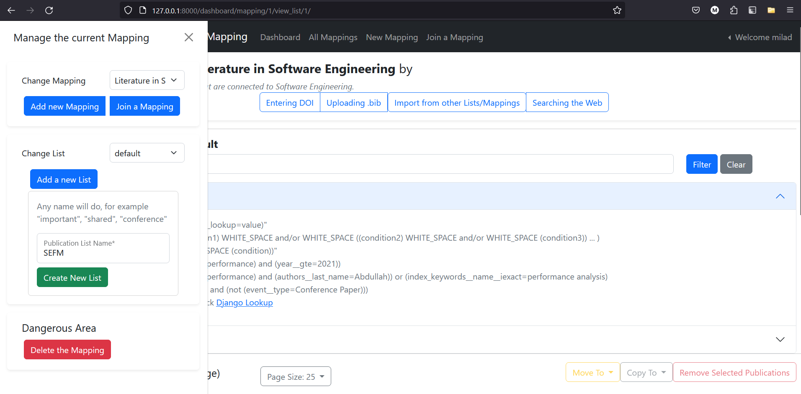
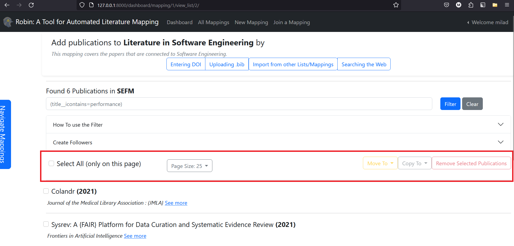

# Robin: A tool for automated literature mapping

This document describes how to install **Robin**, and it provides use-cases where the tool can be helpful. **Robin** helps research teams to conduct literature mapping, which is important part of research methodology. Research team members can use **Robin** to collectively conduct a literature mapping study by create dependent and independent publication lists. This document is consist of the following sections:

* [Installation](#installation)
* [Quick Usage](#quick-usage)
* [Automation](#automation)

## Installation

**Robin** is written in `python-django` which is a Python package, and can be installed in the local library. To skip the installation section and use Docker, refer to the [Docker image](https://zenodo.org/record/8113307). This section covers the following:

1. [Virtual Environment Setup and Package Installation](#virtual-environment-setup)
2. [Migrating (Creating) the Database](#migrating-creating-the-database)
3. [Creating Admin User](#creating-admin-user)
4. [Starting Robin server](#starting-robin-server)
5. [Optional features](#optional-features)
   * [GitHub OAuth](#github-oauth)
   * [IEEE Xplore Search](#ieee-xplore-search)
   * [Scopus Search](#scopus-search)

### Virtual Environment Setup

We recommend using a Python virtual environment, which can be used as the source of packages required for this project. To create the virtual environment, first make sure that `python-dev` is installed.

On Linux

```bash
sudo apt-get update
sudo apt-get install python3 python3-dev python3-venv
```

On Windows

```bash
pip install virtualenv
```

If above command throws an error, then it means the `pip` is not installed, and it needs to be downloaded from the official website <https://docs.python.org/3/installing/index.html#basic-usage>

After installation of `venv` the following command on both Linux and Windows can be used to start a virtual environment.

```bash
python3 -m venv env
```

If faced an issue while creating the virtual environment, refer to <https://docs.python.org/3/library/venv.html>.

If the environment is correctly created, it needs to be activated.

On Linux use:

```bash
source env/bin/activate
```

On Windows use:

```bat
env\Scripts\activate
```

After activating the virtual environment, the command line should look like this:

```bash
(env) /path_to_robin/
```

Now, to install the packages (list of packages is in `requirments.txt`), use `pip` in the virtual environment.

```bash
pip install -r requirements.txt
```

### Migrating (Creating) The Database

The next step is to start a database instance (which in this case is `SQLite`). To do so, use the following command while being on the `robin` folder:

```bash
cd interface
python manage.py migrate
```

From this point, all the given commands will need to be done while in `interface` folder. To check if there is any issue with the project, run the following command

```bash
python manage.py check
```

### Creating Admin User

If no issues were reported, proceed and create a super-user. A super-user is an admin with all privileges. To create such user, run the following command and enter requested information.

```bash
python manage.py createsuperuser
```

### Starting Robin server

Now, it is time to run the server. To start the server, run the following command in the `interface` folder:

```bash
python manage.py runserver
```

Now open <http://127.0.0.1:8000/>, where the Robin app should be accessible (as shown in the following screenshot).


To open the administration of the tool, go to <http://127.0.0.1:8000/admin>.

### Optional Features

#### GitHub OAuth

In order to enable login via GitHub, two main steps should be taken.

* Create an OAuth app on GitHub, which can be done using <https://docs.github.com/en/apps/oauth-apps/building-oauth-apps/creating-an-oauth-app>

* Create a social account on Robin. If the local server is running, simply login to admin section for social accounts (<http://127.0.0.1:8000/admin/socialaccount/socialapp/add/>) and enter the following details:

```
provider: "github",
name: "github",
client_id: "<client id from github app>",
secret: "<secret key from the github app>",
sites: "<choose the site from the list, usually example.com>",
```

Once saved, the other users should be able to login using GitHub account. To use it as another use, try a session on browser, or logout from the admin panel.

#### IEEE Xplore Search

Robin allows importing publications using a search query in the IEEE Xplore database.

The IEEE Xplore database is accessed through API. To get an API access please check <https://developer.ieee.org/>. It might take over a week to activate the `key`. Once the `key` is active, the following information must be added by the admin using this link: <http://127.0.0.1:8000/admin/query/queryplatform/add/>

```
key: <IEEE API KEY>,
source: IEEEXplore,
params: """
{
    "params:{
        "querytext": %query%,
        "open_access": "True",
        "format": "json",
        "apikey": %key%,
        "max_records": %max_results%
        }
}
""",
url: http://ieeexploreapi.ieee.org/api/v1/search/articles,
help_link: https://developer.ieee.org/docs/read/IEEE_Xplore_Metadata_API_Overview,
```

Please note that even with APIs activated, searching is monitored and if the API keys are abused they will be banned by the providers.

#### Scopus Search

Robin allows importing publications using a search query in the Scopus database.

The Scopus database is accessed  through API. To get an API access please check <https://dev.elsevier.com/>. The activation is immediate. Once the `key` is active, the following information must be added by the admin using this link: <http://127.0.0.1:8000/admin/query/queryplatform/add/>

```
key: <SCOPUS KEY>,
source: Scopus,
params: """
{ 
    "headers":{
        "Accept": "application/json",
        "X-ELS-APIKey": %key%
    },
    "params": {
        "start":0,
        "count":%max_results%,
        "query": %query%
    }
}""",
url: https://api.elsevier.com/content/search/scopus,
help_link: "https://dev.elsevier.com/sc_search_tips.html,
```

Please note that even with APIs activated, searching is monitored and if the API keys are abused they will be banned by the providers.

## Quick Usage

In this section, we will describe how to use the tool with  a simple example.
The overall simplified structure of the tool consists of `Mappings`, `Publication Lists` and `Publication Items`.

### Mapping

`Robin` insists on any logged-in user to be part of at least one `Mapping`. A `Mapping` consists of multiple publication lists that are created by team members.

A user with no associated mapping will be directed to this page:

<http://127.0.0.1:8000/dashboard/>


A logged-in user can:

* Create their own `Mapping`
* Join an already created `Mapping`

Once a mapping is created, they are redirected to the `mapping` page where the `secret key` is shown.


The `secret key` can be shared via other communication platforms since at this moment, `Robin` does not have any communication platform.

Now, clicking on the `Go To Publications` will redirect to the publication list page. Each mapping has at least one connected `publication list` all the time.

### Publication Lists

Each `mapping` consists of at least one publication list (the first is called `default`). Once the user is redirected to the publication URL, the following page should be shown:


As shown the list is empty, and there are many ways to populate the list with publications:

#### Using direct DOI

Which calls the DOI.org using JSON acceptance. There is no need to register for the API, but the DOI.org only retries one publication at a time.

Now let's try to add the following publications (or any correct DOI format):

* 10.1016/j.engappai.2019.06.010
* 10.1080/15424060903167229

*NOTE that since the `Debug=True` at this moment, entering a wrong DOI will show as an exception instead of formal bad request*

#### Uploading bibText

It is possible to add publications in bulk using already extracted `BibText`.
To do so, click on `Uploading bib`, and  copy-paste and/or upload a file.
Do not worry if the publications are duplicated, they are checked against their `cleaned_title` and `doi` to avoid duplication.

For example enter the following BiBText twice:

```bibtex
@inproceedings{marshall_systematic_2015,
 location = {New York, {NY}, {USA}},
 title = {Systematic review toolbox: a catalogue of tools to support systematic reviews},
 isbn = {978-1-4503-3350-4},
 url = {https://dl.acm.org/doi/10.1145/2745802.2745824},
 doi = {10.1145/2745802.2745824},
 series = {{EASE} '15},
 shorttitle = {Systematic review toolbox},
 abstract = {Systematic review is a widely used research method in software engineering, and in other disciplines, for identifying and analysing empirical evidence. The method is data intensive and time consuming, and hence is usually supported by a wide range of software-based tools. However, systematic reviewers have found that finding and selecting tools can be quite challenging. In this paper, we present the Systematic Review Toolbox; a web-based catalogue of tools, to help reviewers find appropriate tools based on their particular needs.},
 pages = {1--6},
 booktitle = {Proceedings of the 19th International Conference on Evaluation and Assessment in Software Engineering},
 publisher = {Association for Computing Machinery},
 author = {Marshall, Christopher and Brereton, Pearl},
 urldate = {2023-06-19},
 date = {2015-04-27},
 keywords = {documentation},
}
```

A whole file can also be uploaded. Try  uploading [`paper.bib`](readme_contents/paper.bib). Since, we have already uploaded some of the publications, the duplicated ones will not be re-added. The publications that are listed, are the ones that have been reviewed conducting this research. So we can move them to new list. Create a new list, using `Navigate Mapping`, and name it SEFM2023



#### Importing form Other Lists

Another way to import publications is to import from other lists that the user is authorized. Click on Import from other lists, and pick `default`.

The copying and moving to other lists can also be done within the main publication list page, shown in red box:



#### From Web Search

It is possible to import publications using the connected paper search APIs such as Scopus and IEEExplore. To activate this, the admin must connect these APIs as described above ([Scopus](#scopus-search), [IEEE Xplore](#ieee-xplore-search)).

After activating the search APIs, then publications can be searched using a query text, and then they can be added to any list that the user is authorized.


* NOTE that the publications are not stored in database by just searching, but they are when the user add them to the publications lists. However, once the publication list is updated, the query information is saved.*

## Automation

One of key contributions of the `Robin` is the possibility to automatically update lists. It is possible to filter the current publication lists and create follower lists.

A list can follow other lists, as well it can have its own followers. If list `A` is following list `B` with given condition, once `B` is updated with newer publications, `A` is also updated if the new publications meet the conditions.

For example, let's create a follower list that follows the default list, with the condition of newest publications only.

The condition is written in terms of `Django-lookups`, and the following filter text, only accepts publications that are published in 2019 and later.

```python
(year__gte=2019)
```


Now, since there are some results, we can follow the `default` list with condition `year>=2019` and name it `recent`.

It is then possible to follow/unfollow other lists as shown:


Now if we add the following two publications to the `default` list, the publication of `2021` will also be added to `recent`

* 10.1109/ACCESS.2021.3076118
* 10.1109/ACCESS.2018.2865383

Another example will be to filter out only journal papers which are between 2010 and 2020 with following:

```python
(((year__gte=2010) and (year__lte=2020)) and (event__type=Journal Article))
```
